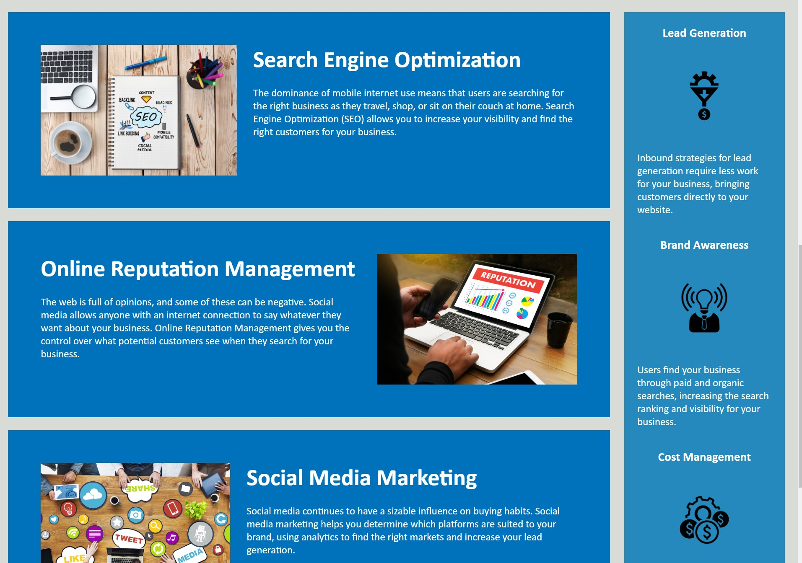

# HTML-Git-CSS-Challenge

HTML, Git, and CSS challenge week 1

Project HTML-GIT-CSS-Challange is the first homework challange of this fullstack bootcamp. By using premade code downloaded from GitLab, I was able to create a fully fuctioning static website using Git, HTML, and CSS.

To start this project I downloaded the repo provided to us.

Once this was completed I then made the following changes using HTML and CSS that I have learnt over the last week: 1. Source code has a semantic html structure with elements. 2. Elements follow logical structure. 3. Accessibility increased with added alt text on all img's. 4. Sequential heading attributes. 5. Added comments to CSS to increace readibility. 6. And lastly a descriptive title in the head.

A challanges I faced : 1. I revised exactly what semantic html structure is, and the different <tags> that can be used. I learnt <figure>, <aside>, and <article> which creates an accessible website for computers to assist those who require such tools, and implimented into my version. 2. learning the importance of a README file and how to write one, so I hope this ticks all the boxes!

Here is a screenshot of the final product:

LINK TO DEPLOY: https://nessjade96.github.io/HTML-Git-CSS-Challenge/
